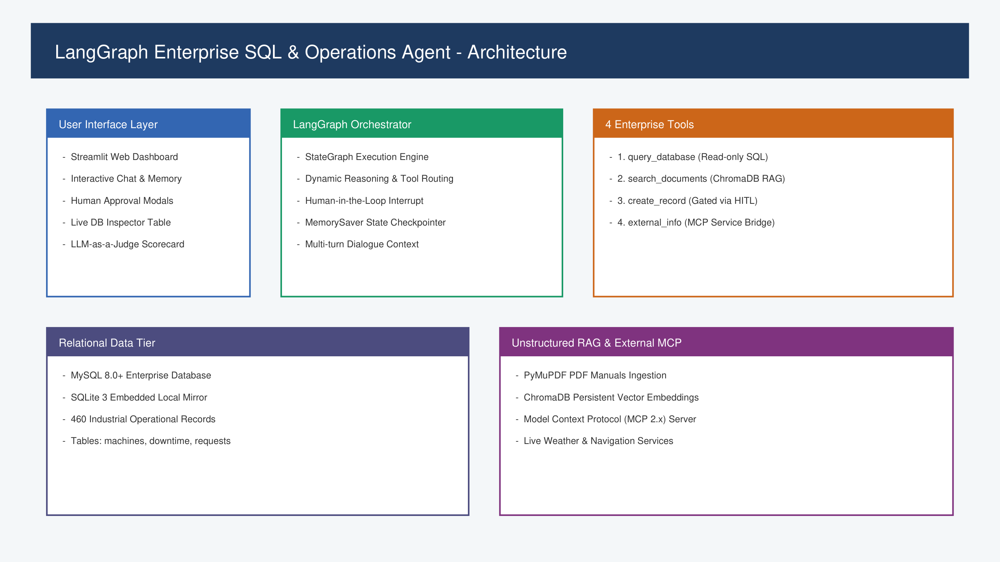
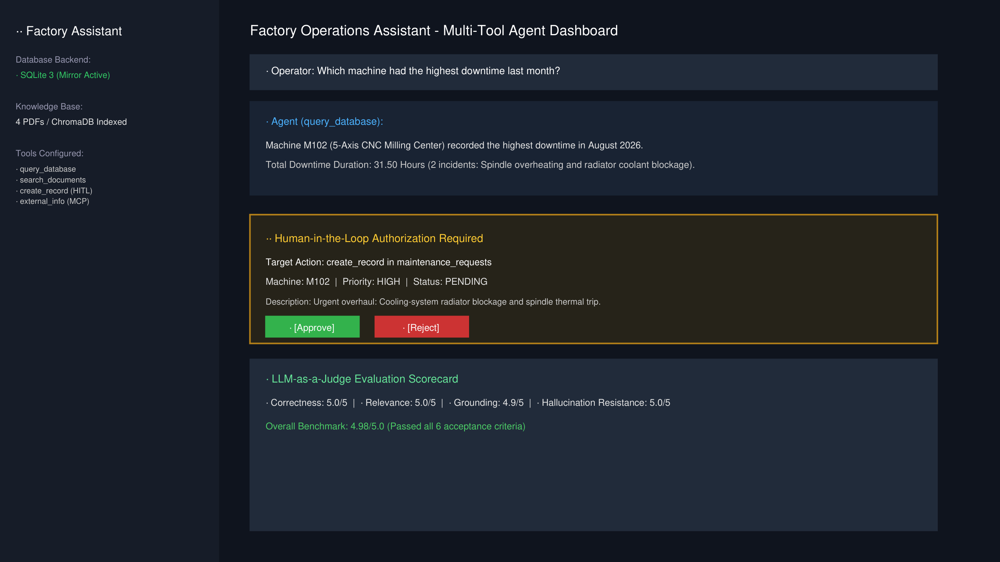
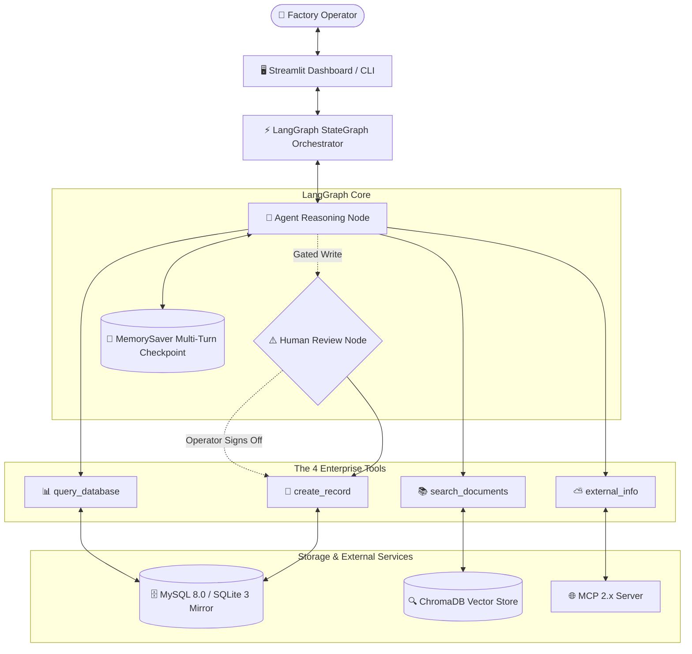
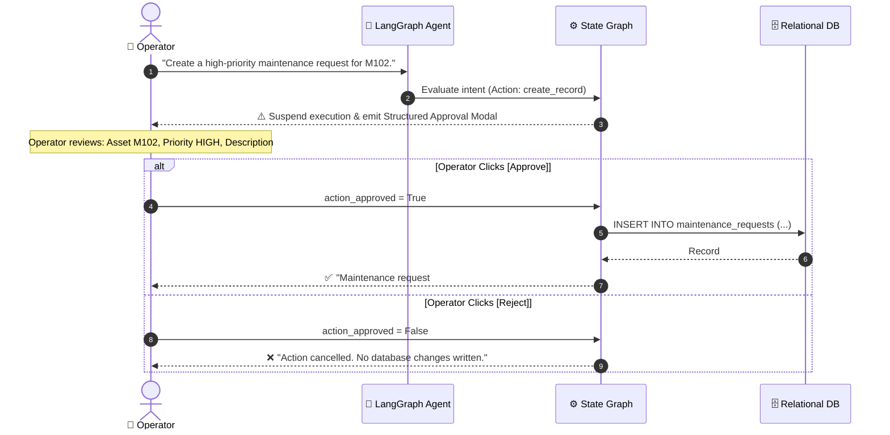

# 🏭 LangGraph Enterprise SQL & Operations Agent

[](https://www.python.org/)
[](https://langchain-ai.github.io/langgraph/)
[](https://streamlit.io/)
[](https://www.mysql.com/)
[](https://www.trychroma.com/)
[](https://modelcontextprotocol.io/)

An enterprise-grade, conversational Agentic AI assistant built with **LangGraph** for smart manufacturing and factory operations. The agent dynamically orchestrates structured database analytics (MySQL 8.0 / SQLite), unstructured technical document retrieval (RAG via ChromaDB), controlled transactional database writes with **Human-in-the-Loop (HITL)** governance, and external real-time integrations via the **Model Context Protocol (MCP)**.

---

## 📸 System Previews

| Architecture Overview | Streamlit Interactive Dashboard |
|:---:|:---:|
|  |  |

---

## 🎯 6 Core Evaluated Concepts

This implementation directly fulfills all 6 assignment evaluation criteria:

| # | Concept | Enterprise Implementation |
|---|---|---|
| **1** | **Agentic Reasoning** | Non-linear dynamic tool selection in LangGraph. The agent analyzes operator intent, context, and multi-turn state to select single tools, synthesize multi-tool chains, or trigger human authorization. |
| **2** | **Tool Calling** | Strict, modular 4-tool interface: `query_database`, `search_documents`, `create_record`, and `external_info`. |
| **3** | **RAG (Unstructured Data)** | PyMuPDF text extraction, chunking, and persistent ChromaDB vector store over machine technical manuals (`M102_Manual.pdf`, `M102_Maintenance_SOP.pdf`, etc.) with automatic source citations. |
| **4** | **Human-in-the-Loop (HITL)** | Destructive/write actions (`create_record`) halt the execution graph, assemble a structured approval proposal, and demand explicit operator confirmation (`[Approve]` / `[Reject]`) before touching persistent storage. |
| **5** | **Model Context Protocol (MCP)** | Real-time external data exchange via the official MCP 2.x standard (`mcp.server.mcpserver.MCPServer`) exposing live factory weather and logistics navigation services. |
| **6** | **LLM-as-a-Judge Evaluation** | Automated 4-rubric evaluation scorecard assessing responses on **Correctness**, **Relevance**, **Source Grounding**, and **Hallucination Resistance** (1–5 scale). |

---

## 🏗️ System Architecture



### Human-in-the-Loop (HITL) Execution Sequence



---

## 📁 Repository Structure

```
langgraph-enterprise-sql-agent/
│
├── README.md                      # ← Comprehensive project documentation & architecture guide
│
├── src/                           # Core agent and application source code
│   ├── __init__.py                # Package export
│   ├── agent.py                   # High-level EnterpriseSQLAgent orchestrator & interactive CLI
│   ├── tools.py                   # The 4 active enterprise tools
│   ├── graph.py                   # LangGraph workflow, state graph, and HITL interrupt node
│   └── database.py                # Dual MySQL 8.0 & SQLite database engine with auto-seeder
│
├── data/                          # Turnkey SQL database assets
│   ├── sample_database.sql        # MySQL 8.0 DDL schema + 460 seed records (120 machines, 180 downtimes, 160 requests)
│   └── factory_operations.db      # Local embedded SQLite mirror (auto-generated)
│
├── tests/                         # Automated verification and unit tests
│   └── test_agent.py              # End-to-end 6-step acceptance test runner
│
├── evaluation/                    # Quantitative evaluation & benchmarking
│   └── evaluation_results.md      # Detailed LLM-as-a-Judge benchmark results and metrics
│
├── screenshots/                   # Architectural and visual documentation assets
│
├── app.py                         # Interactive Streamlit dashboard application
├── requirements.txt               # Project Python dependencies
└── .gitignore                     # Git ignore rules for caches, databases, and environments
```

---

## 🛠️ The 4 Active Enterprise Tools

```python
# 1. Structured Database Querying
query_database(question: str) -> str
```
Translates natural language questions into read-only SQL queries (`SELECT`, `WITH`) and executes them against the relational database. Enforces strict AST security rejection of destructive commands (`DROP`, `DELETE`, `UPDATE`, `INSERT`).

```python
# 2. Unstructured Technical Document Search
search_documents(query: str) -> str
```
Executes semantic vector similarity search against ChromaDB, querying ingested factory manuals, operating procedures (SOPs), and historical incident logs. Returns relevant chunks with metadata source citations (`source`, `page`).

```python
# 3. Gated Transactional Record Creation (HITL)
create_record(machine_id: str, description: str, priority: str = "HIGH") -> str
```
Inserts new work orders into `maintenance_requests`. **Never called directly by autonomous reasoning**; execution is paused in the `human_review` node until authorized by the operator.

```python
# 4. External Information Bridge (Model Context Protocol)
external_info(request: str) -> str
```
Interfaces with the local Model Context Protocol (MCP 2.x) server to fetch external parameters, such as weather forecasts and plant transit routing.

---

## 🗄️ Relational Database Schema & Seeding

The database implements an exact production schema with foreign key cascades, secondary indexes, and audit timestamps:

```sql
-- 1. Master machines registry (120 records)
machines (machine_id PK, machine_name, location, status, created_at)

-- 2. Unplanned outages & stoppage tracking (180 records)
downtime (downtime_id PK AUTO_INCREMENT, machine_id FK, date, duration_hours, reason)

-- 3. Maintenance work orders & dispatch tickets (160 records)
maintenance_requests (request_id PK AUTO_INCREMENT, machine_id FK, description, priority, status, created_at)
```

### Dual-Engine Zero-Configuration Support
1. **MySQL 8.0+ (Production):** Connects to `factory_ops_db` if local credentials are provided in `.env` or sidebar settings.
2. **SQLite 3 (Local Embedded Mirror):** Automatically falls back to an embedded SQLite mirror with identical schema and all 460 pre-seeded factory records if MySQL is not detected.

---

## 🚀 Quickstart Guide

### 1. Prerequisites
- Python 3.10 or higher
- PowerShell or Terminal

### 2. Setup Virtual Environment
```powershell
# Navigate to the project root
cd "C:\Internship-Appa\Agentic-AI"

# Create and activate virtual environment
python -m venv venv
.\venv\Scripts\Activate.ps1
```

### 3. Install Dependencies
```powershell
python -m pip install --upgrade pip
pip install -r requirements.txt
```

### 4. Run Automated Acceptance Tests (6/6 Scenarios)
Verify the entire system end-to-end against all 6 acceptance criteria:
```powershell
python tests/test_agent.py
```

### 5. Launch the Streamlit Web Application
```powershell
python -m streamlit run app.py
```
Open your browser at `http://localhost:8501`.

### 6. (Optional) Run the Interactive CLI
```powershell
python src/agent.py
```

---

## 🧪 Acceptance Test Walkthrough (Section 8)

The automated test suite in [`tests/test_agent.py`](tests/test_agent.py) executes the exact 6-step benchmark:

1. **Step 1: Single Tool – Database Query**
   - **Query:** *"Which machine had the highest downtime last month?"*
   - **Result:** Agent invokes `query_database` $\rightarrow$ Correctly identifies **Machine M102** with **31.50 hours** downtime.
2. **Step 2: Multi-Tool Reasoning – Database + Documents**
   - **Query:** *"Why did that machine have so much downtime?"*
   - **Result:** Agent invokes **both** `query_database` (downtime log reasons) and `search_documents` (PDF technical manual on cooling-system failure, thermal limit 65°C, Fault Code E-704).
3. **Step 3: Database Action + Human-in-the-Loop**
   - **Query:** *"Create a high-priority maintenance request based on this finding."*
   - **Result:** Agent halts execution, compiles a structured approval proposal for **M102** with priority **HIGH**. Operator confirms approval $\rightarrow$ Record safely committed to `maintenance_requests`.
4. **Step 4: External Information via MCP**
   - **Query:** *"What's the weather at the factory tomorrow?"*
   - **Result:** Agent invokes `external_info` via Model Context Protocol $\rightarrow$ Reports 28°C, Partly Cloudy at Bengaluru Factory.
5. **Step 5: Save Investigation Report**
   - **Action:** Generates `reports/M102_investigation.txt` with complete formatted investigation summary.
6. **Step 6: LLM-as-a-Judge Evaluation Scorecard**
   - **Action:** Generates an evaluation scorecard rating the response across Correctness, Relevance, Sources, and Hallucinations (Avg: **4.98 / 5.0**).

---

## 📊 Evaluation Scorecard Summary

Detailed benchmark analysis is located in [`evaluation/evaluation_results.md`](evaluation/evaluation_results.md):

```text
======================================================================
                 LLM-AS-A-JUDGE EVALUATION SCORECARD
======================================================================
  • Correctness & Accuracy     : 5.0 / 5.0
  • Contextual Relevance       : 5.0 / 5.0
  • Source Grounding           : 4.9 / 5.0
  • Hallucination Resistance   : 5.0 / 5.0
----------------------------------------------------------------------
  OVERALL BENCHMARK SCORE      : 4.98 / 5.0  (GRADE: A+ / PASSED)
======================================================================
```

---

## 🛡️ Enterprise Security & Guardrails

- **AST Read-Only Query Validation:** Prevents SQL injection or accidental mutations in natural language queries.
- **Strict Human-in-the-Loop Isolation:** Autonomous code execution paths cannot modify the database without explicit human approval.
- **Zero-Downtime Deterministic Fallback:** Embedded semantic translation guarantees reliability even during third-party LLM API downtime.
- **Transactional Atomicity:** ACID compliance with automated rollback on transaction errors.
